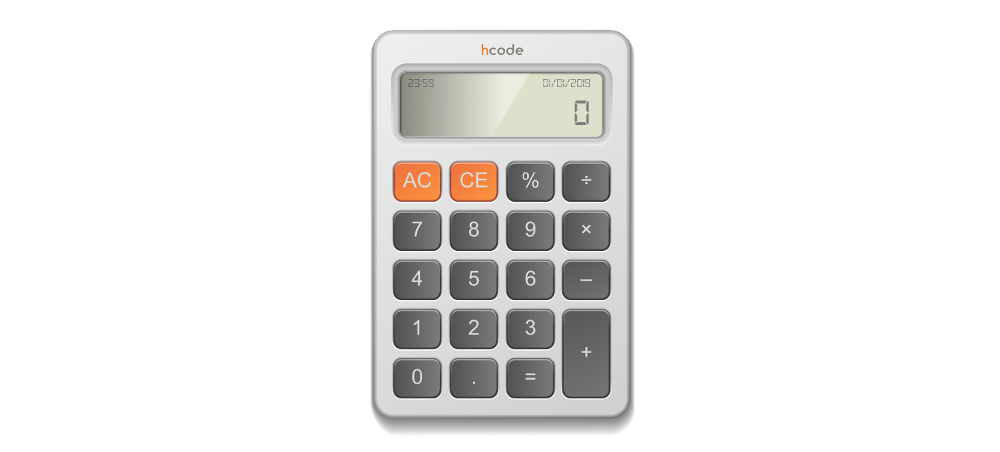

# Calculadora JavaScript

Calculadora desenvolvida como exemplo do Curso Completo de JavaScript na Udemy.com.

  <a aria-label="JavaScript" href="https://developer.mozilla.org/pt-BR/">
    </img>
  </a>
  <a aria-label="Concluindo em " href="#">
    </img>
  </a>

## Descrição

Projeito feito seguindo o método de estudo HCode no curso da udemy

## Licença

[MIT](./LICENSE) &copy; 
